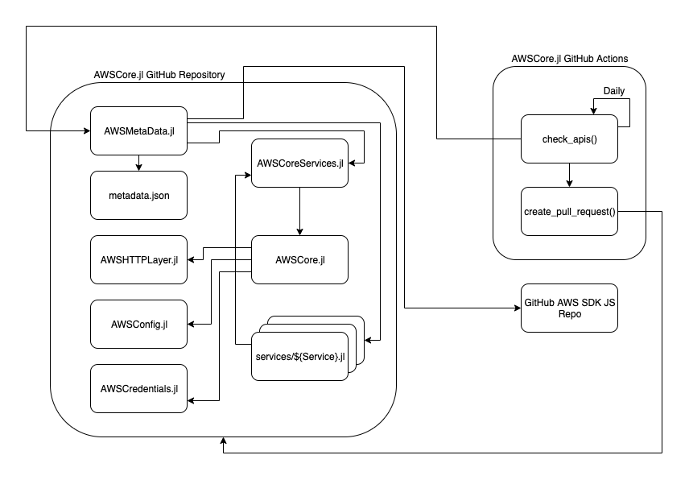
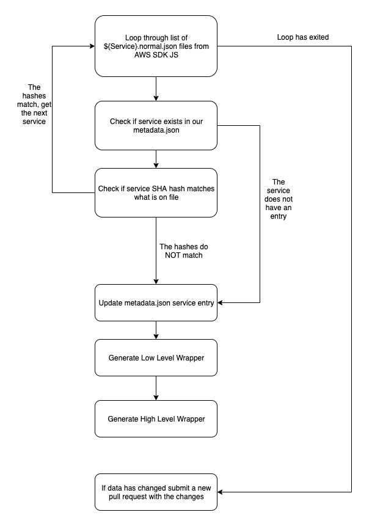

# Current state of AWS in JuliaCloud

## Contact Info
matt.brzezinski@invenia.ca

## Tenets
- Make using AWS easy for the average Julia user
- Use automation and code generation as much as possible
- Create a simple straight-forward systems design

## Executive Summary  -- TODO
Using AWS Services in Julia is currently more difficult than it needs to be.
Users are currently limited to the low-level wrappers which require the knowledge of everything that goes into an operation.
Or they are limited to high-level wrappers which may or may not be available for the service which the want to use.

## Current State
There are two categories of packages currently supporting AWS usage in `JuliaCloud`.

### Low-Level Wrapper
[`AWSCore.jl`](https://github.com/JuliaCloud/AWSCore.jl) is the most popular low-level package.
The package consists of five major files:

- `AWSAPI.jl`: Generates the `Services.jl` file which contains the low-level API wrappers for each AWS Service
- `AWSCore.jl`: Processes `json, query, xml, etc.` request protocols
- `AWSCredentials.jl`: Handles retrieving AWS Credentials from locations such as environment variables, credential / configuration files, etc.
- `Services.jl`: Contains a function for every AWS Service
- `signaturev4.jl`: Creates the `AWS4AuthLayer` to be inserted into the HTTP stack and signs the requests with AWS authentication

Inside of `Services.jl` each AWS Service has its own respective service, which is used to call it:
```julia
function s3(aws::AWSConfig, verb, resource, args=[])
    AWSCore.service_rest_xml(
        aws;
        service      = get(aws, :service_name, "s3"),
        version      = "2006-03-01",
        verb         = verb,
        resource     = resource,
        args         = args)
end
```

`AWSCore.jl` works by running a `Node.js` server which parsing down the [`AWS SDK JS`](https://github.com/aws/aws-sdk-js) to create definitions for each AWS Service.
To use the package it is then up to the end user to know how to call the appropriate operation, which can be done by referencing the [`AWS Documentation`](https://docs.aws.amazon.com/index.html).

e.g. [`ListBuckets`](https://docs.aws.amazon.com/AmazonS3/latest/API/API_ListBuckets.html) operation on `AWS S3`
```julia
using AWSCore.Services
Services.s3(aws_config(), "GET", "/")
```

Having functions defined for each service in this form does not take advantage multiple dispatch.
In its current state there is no automated or documented steps to update the `Services.jl` file.
If Amazon releases a new service, or updates the API for an existing service the process of updating `Services.jl` needs to be done manually.

#### High-Level Wrapper(s)
These packages are much more simple to use as the end user only needs to know the operation they wish to perform.
However these high-level packages are currently hand written, limited to certain AWS Services, are prone to errors and/or have limited functionality.

To use a package such as [`AWSS3.jl`](https://github.com/JuliaCloud/AWSS3.jl), the end user only needs to know how to call the operation.

e.g. `ListBuckets` operation on `AWS S3`
```julia
using AWSCore

s3_list_buckets()
```

## Proposed Solution -- TODO
I propose that we tag the current version of `AWSCore.jl` to `v1.0`, and begin working on `v2.0`.
Version 2 of `AWSCore.jl` would consist of:

- Taking advantage of Julia's multiple dispatch for making AWS service requests
- Automating the creation and updating of service definitions using GitHub actions

The proposed architecture for a system would look like:



### `AWSCore.jl`
Would hold the `structs` for each type of request we will dispatch on. 
It will also contain its current functionality of making the requests themselves (`JSON, REST-XML, etc.`)
These request function can be used as an entry point, however they are not the recommended route.

### `AWSCoreServices.jl`
This file will be auto-generated by `AWSMetadata.jl`.
It will contain the low-level API wrapper objects for each respective service.
This will be the entry point for the low-level API wrapper.

i.e.
```julia
module AWSCoreServices
# ...
const sagemaker_runtime = AWSCorePrototype.RestXMLService("runtime.sagemaker", "2017-05-13")
const s3 = AWSCore.RESTXMLService("s3", "2006-03-01")
const s3_control = AWSCorePrototype.RestXMLService("s3-control", "2018-08-20")
const sagemaker = AWSCorePrototype.JSONService("api.sagemaker", "2017-07-24", "1.1", "SageMaker")
# ...
end
```

### `services/${Service}.jl`
These files will be auto-generated by `AWSMetadata.jl`.
Each file will be a sub-module for an AWS Service and contain high-level wrappers for each operation for a service.
These will be the entry points for the high-level API wrappers.

i.e.
```julia
module s3
# ...
ListObjects(Bucket) = s3("GET", "/$Bucket")
ListObjectVersions(Bucket) = s3("GET", "/$Bucket?versions")
HeadObject(Bucket, Key) = s3("HEAD", "/$Bucket/$Key+")
PutBucketAcl(Bucket) = s3("PUT", "/$Bucket?acl")
# ...
end
```

### `AWSMetadata.jl` and `metadata.json`
`AWSMetadata.jl` contains all the functions for updating both the low and high level API wrappers.
`metadata.json` is used in tandem to hold the `SHA` hashes for each version, as well as their API Versions.

### GitHub Actions
These actions will be used daily to check for new AWS Service APIs or updates to existing ones.
If an API needs to be created or updated it will automatically regenerate the low and high level wrappers and submit a merge request with the changes.

## Use Cases

### Creating or Updating an API Wrapper


### Low-Level Wrapper Usage
Low-Level wrapper usage would look similar to the current `AWSCore.jl`.


```julia
include("AWSCorePrototypeServices.jl")
s3 = AWSCorePrototypeServices.s3

buckets = s3("GET", "/")

println(buckets)
```

### High-Level Wrapper Usage

```julia
include("services/s3.jl")
using .aws_s3

buckets = aws_s3.ListBuckets()
println(buckets)
```

## In Scope -- TODO

## Out of Scope -- TODO

## Measures of Success -- TODO

### Update API Definitions

### Usage of Low Level Wrapper

### Usage of High Level Wrapper

### Converting high-level to low-level code

## Dependencies
To automate the creation of high and low level wrappers in Julia we must pull AWS Service definitions from an external source.
The [`JavaScript SDK`](https://github.com/aws/aws-sdk-js/tree/master/apis) is the most simple to parse as all service definitions are defined as JSON files.
While other SDKs define them on a per language basis.

We need to also have some service to run the code which will automate the creation or updating of a service, such as [`GitHub actions`](https://github.com/features/actions).

Current Julia Package dependencies
- DataStructures
- Dates
- HTTP
- Inifile
- JSON
- LazyJSON
- MbedTLS
- Mocking
- Retry
- Sockets
- SymDict
- XMLDict

## Functional Requirements -- TODO

## Non-Functional Requirements -- TODO

## Metrics -- TODO

## Alarms -- TODO

## Open Issues -- TODO

## Appendix

### Number of Amazon Services
- `api_files.txt` is a list of all files in the [`AWS SDK JS APIs`](https://github.com/aws/aws-sdk-js/tree/master/apis)

```python
import re

with open("api_files.txt") as f:
  services = set()

  for line in f.readlines():
    services.add(re.split("-\d", line)[0])
  print(len(services))  # 220 (as of 2019-12-17
```

### List of low-level wrappers
- [`JuliaCloud/AWS.jl`](https://github.com/JuliaCloud/AWS.jl)
- [`JuliaCloud/AWSAPI.jl`](https://github.com/JuliaCloud/AWSAPI.jl)
- [`JuliaCloud/AWSCore.jl`](https://github.com/JuliaCloud/AWSCore.jl)

### List of high-level wrappers
- [`JuliaCloud/AWSS3.jl`](https://github.com/JuliaCloud/AWSS3.jl)
- [`JuliaCloud/AWSSQS.jl`](https://github.com/JuliaCloud/AWSSQS.jl)
- [`samoconnor/AWSDB.jl`](https://github.com/samoconnor/AWSSDB.jl)
- [`samoconnor/AWSEC2.jl`](https://github.com/samoconnor/AWSEC2.jl)
- [`samoconnor/AWSIAM.jl`](https://github.com/samoconnor/AWSIAM.jl)
- [`samoconnor/AWSLambda.jl`](https://github.com/samoconnor/AWSLambda.jl)
- [`samoconnor/AWSSES.jl`](https://github.com/samoconnor/AWSSES.jl)
- [`samoconnor/AWSNS.jl`](https://github.com/samoconnor/AWSSNS.jl)

### List of available AWS SDKs
- [`.NET`](https://github.com/aws/aws-sdk-net)
- [`Android`](https://github.com/aws-amplify/aws-sdk-android)
- [`C++`](https://github.com/aws/aws-sdk-cpp)
- [`Go`](https://github.com/aws/aws-sdk-go)
- [`Java - v1`](https://github.com/aws/aws-sdk-java)
- [`Java - v2`](https://github.com/aws/aws-sdk-java-v2)
- [`JavaScript`](https://github.com/aws/aws-sdk-js)
- [`PHP`](https://github.com/aws/aws-sdk-php)
- [`Ruby`](https://github.com/aws/aws-sdk-ruby)
